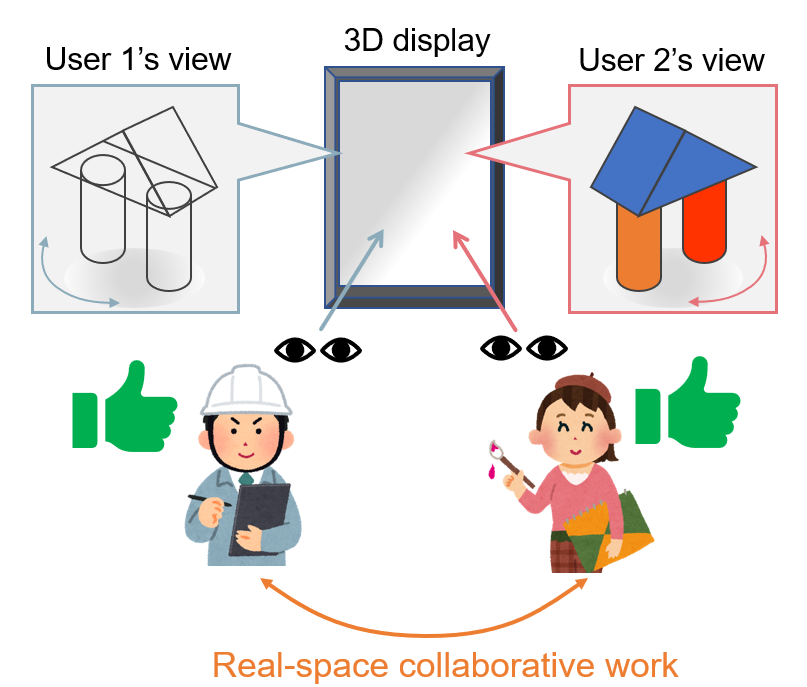
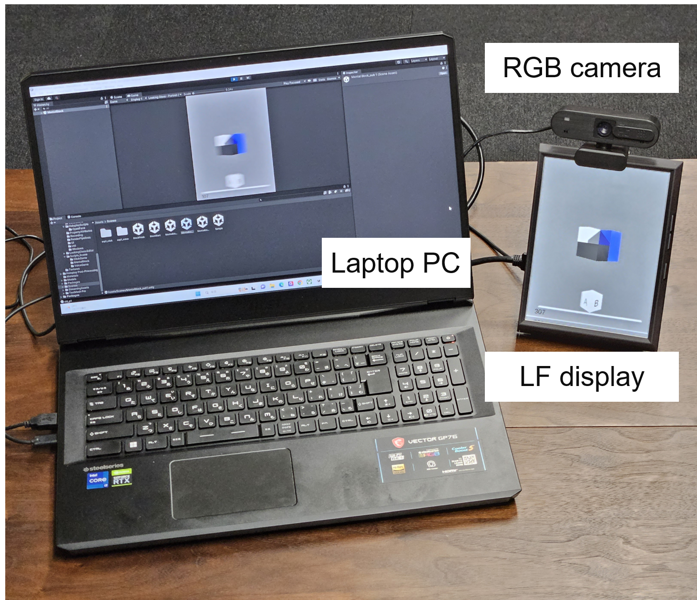
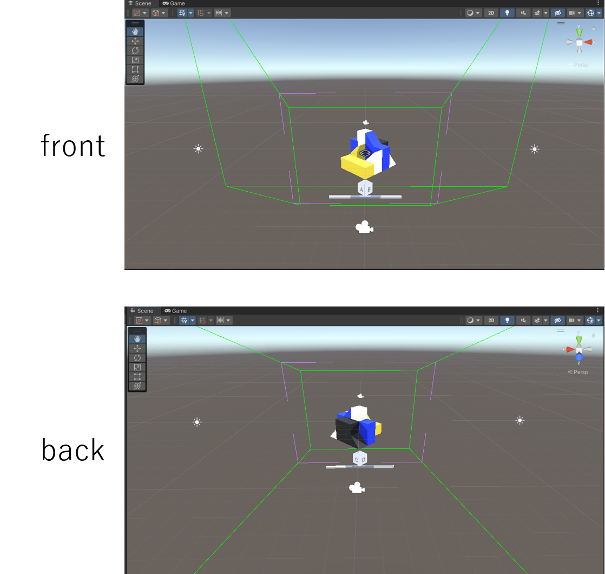
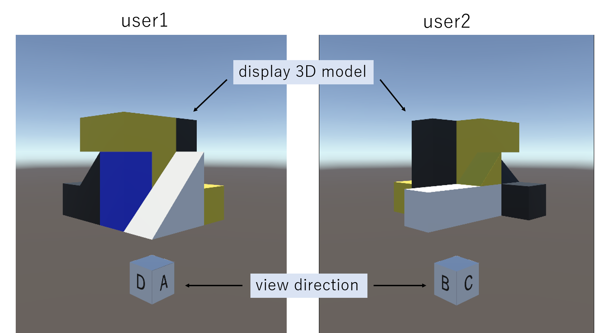

# 裸眼立体視ディスプレイとヘッドトラッキングを用いた自由視点立体映像の個別提示による共同作業システム

## 概要
複数人によるユーザ依存の視点での同時裸眼立体視 
・各ユーザの視点を認識することで、二人のユーザが３Dシーンを独立して視認可能 
・ユーザごとに異なる立体映像を単一ディスプレイに表示 
・ヘッドトラッキングを利用した３D視点移動のインターフェース 

## デバイス
・裸眼立体ディスプレイ：Looking Glass Portrait

・Webカメラ：elecom UCAM-C820ABBK

## ソフトウェア
・Unity（version:2021.3.12）

・Looking Glass Unity Plugin

・顔認識：OpenFace（https://github.com/TadasBaltrusaitis/OpenFace）

## 実行方法
1. OpenFace_2.2.0_win_x64を任意の場所にダウンロード（Unityプロジェクト外で良い）

2. Assets/Holoplay/Script/LookigGlass/HoloplayScripts/OpenFace/OpenFaceReader.cs でOpenFaceの出力データ(.csv)のパス設定

3. cmdで「.\FaceLandmarkVidMulti.exe -device 0 -of realtime」を実行

4. Unity実行

※詳細 
・オブジェクト'DataReader'のスクリプト'DataRead'のformat_tracking, format_splitにより 
　トラッキングによる多方向立体視、画面分割のオン・オフ選択可能 
・シーン内の表示オブジェクトを変更することで好きなモデルを多視点立体視できる 

## 出力
#### 表示シーン

一つの３Dモデルを複数人で多方向から立体視する 
A~Dが書かれたCubeは視点方向を表す 

#### ディスプレイ表示

user1は方向DAから、user2はBCから同時に立体視可能 
各ユーザは独立して自由立体視できる 
